# Digital Dirham CBDC v2 - Component Architecture Diagrams

## Overview

This document contains comprehensive Mermaid diagrams showing the Digital Dirham v2 architecture with all services, APIs, databases, message queues, and data flows.

---

## DIAGRAM 1: System Context (High-Level)

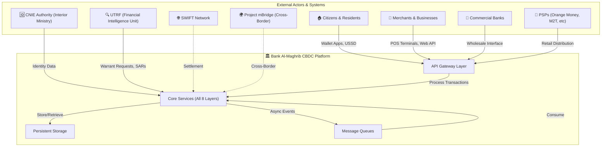

---

## DIAGRAM 2: Full Component Architecture (8 Layers)

```mermaid
graph TB
    subgraph L1["LAYER 1: MONETARY LAYER"]
        IS_ENGINE["Issuance Engine"]
        RED_ENGINE["Redemption Engine"]
        POL_ENGINE["Monetary Policy Engine<br/>(OPA Rules)"]
        SUPP_MONITOR["Supply Monitoring Engine"]
    end

    subgraph L2["LAYER 2: SETTLEMENT LAYER"]
        TX_VALIDATOR["Transaction Validator"]
        CONSENSUS["Consensus Engine<br/>(7-node BFT)"]
        LEDGER_MGR["Ledger Manager<br/>(Hyperledger Fabric)"]
        FINALITY["Finality Service"]
    end

    subgraph L3["LAYER 3: COMPLIANCE LAYER"]
        SANC_ENGINE["Sanctions Screening"]
        BEHAV_ANOMALY["Behavioral Anomaly Detector<br/>(ML Models)"]
        SAR_ENGINE["SAR Generator"]
        CAPCTRL_ENGINE["Capital Controls Engine"]
    end

    subgraph L4["LAYER 4: PRIVACY LAYER"]
        BLIND_SIG["Blind Signature Engine<br/>(Tier 1)"]
        PSEUDO_ENGINE["Pseudonymous Identity Engine<br/>(Tier 2)"]
        ZKP_ENGINE["Zero-Knowledge Proof Engine"]
        PRIVACY_AUDIT["Privacy-Preserving Audit"]
    end

    subgraph L5["LAYER 5: IDENTITY LAYER"]
        CNIE_ENGINE["CNIE Integration Engine"]
        KYC_TIER["KYC Tier Assignment"]
        VERIF_CRED["Verifiable Credentials Engine"]
        DID_MANAGER["DID Manager"]
    end

    subgraph L6["LAYER 6: DISTRIBUTION LAYER"]
        WHOLESALE["Wholesale Interface"]
        RETAIL["Retail Wallet Interface"]
        AGENT_MGR["Agent Network Manager"]
        OPEN_API["Open API Gateway"]
    end

    subgraph L7["LAYER 7: OFFLINE LAYER"]
        SE_MGR["Secure Element Manager"]
        OFFLINE_LEDGER["Offline Ledger Cache"]
        SYNC_ENGINE["Sync Engine"]
        DOUBLESPEND["Double-Spend Detector"]
    end

    subgraph L8["LAYER 8: CROSS-BORDER LAYER"]
        mBRIDGE_CONN["mBridge Connector"]
        ICEBREAKER_CONN["Icebreaker Connector"]
        FX_ENGINE["FX Conversion Engine"]
        CAPCTRL_BORDER["Border Capital Controls"]
    end

    subgraph DB["PERSISTENT STORAGE"]
        FABRIC_LEDGER["Hyperledger Fabric Ledger<br/>(Canonical)"]
        PG_MAIN["PostgreSQL (Main)<br/>- Wallets<br/>- Transactions<br/>- KYC Data<br/>- Audit Trail"]
        PG_CACHE["PostgreSQL (Cache)<br/>- Sanctions List Cache<br/>- Bloom Filters<br/>- ML Model State"]
        REDIS["Redis (Hot Cache)<br/>- Session State<br/>- Rate Limits<br/>- ZKP Circuits"]
    end

    subgraph MQ["MESSAGE QUEUES"]
        KAFKA["Apache Kafka<br/>- Settlement Events<br/>- AML Alerts<br/>- Audit Stream"]
    end

    % Interconnections between layers
    L1 -.->|Issues/Retires DD| L2
    L1 -.->|Policy Rules| L3
    L2 -.->|Receives Tx| L3
    L2 -.->|Validates| L4
    L3 -.->|Escalates| UTRF_EXT["UTRF"]
    L4 -.->|Privacy Tier| L5
    L5 -.->|KYC Data| L4
    L6 -.->|User Requests| L1
    L6 -.->|User Requests| L2
    L7 -.->|Offline Sync| L2
    L8 -.->|Cross-Border Tx| L2
    
    % Data flows to storage
    L1 --> FABRIC_LEDGER
    L2 --> FABRIC_LEDGER
    L2 --> PG_MAIN
    L3 --> PG_MAIN
    L5 --> PG_MAIN
    L6 --> REDIS
    L7 --> OFFLINE_LEDGER
    
    % Event flows
    L2 --> KAFKA
    L3 --> KAFKA
    L7 --> KAFKA
    KAFKA -.->|Consume Events| L1
    KAFKA -.->|Consume Events| L3
    KAFKA -.->|Consume Events| L8
```

---

## DIAGRAM 3: Layer 1 - Monetary Layer (Detailed)

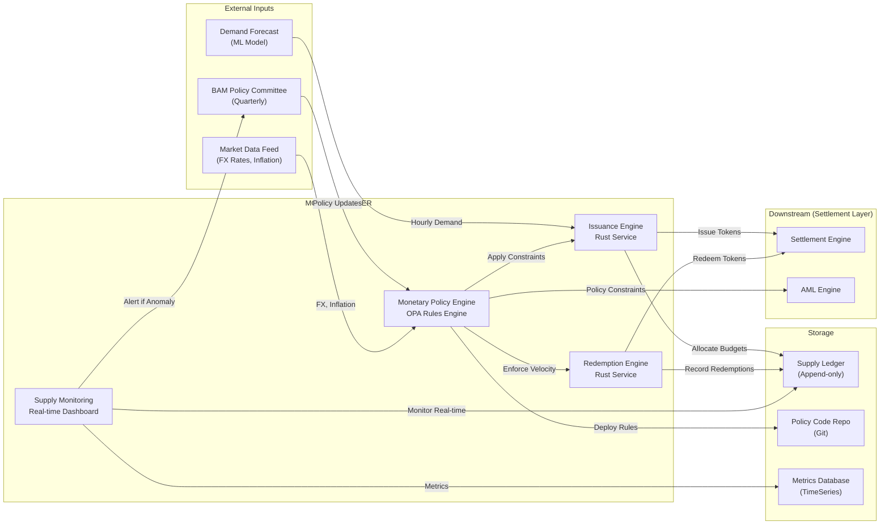

---

## DIAGRAM 4: Layer 2 - Settlement Layer (Detailed)

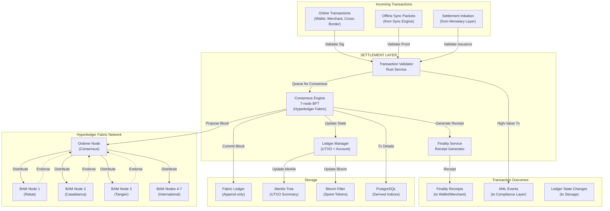

---

## DIAGRAM 5: Layer 3 - Compliance Layer (Detailed)

```mermaid
graph TB
    subgraph COMPLIANCE["COMPLIANCE LAYER"]
        SANC_ENGINE["Sanctions Screening<br/>Bloom Filter + Fuzzy Match"]
        BEHAV_ANOMALY["Behavioral Anomaly Detector<br/>XGBoost + LSTM + GNN"]
        SAR_ENGINE["SAR Generator<br/>Regulatory Reporting"]
        CAPCTRL_ENGINE["Capital Controls<br/>Daily/Monthly/Annual Limits"]
    end

    subgraph INPUTS["Transaction Flow"]
        INCOMING_TX["Incoming Transaction"]
    end

    subgraph ML_MODELS["ML Models"]
        STRUCTURING_MODEL["Structuring Detector<br/>(LSTM)"]
        NETWORK_MODEL["Network Anomaly<br/>(GNN)"]
        CROSSBORDER_MODEL["Cross-Border Anomaly<br/>(Isolation Forest)"]
    end

    subgraph LISTS["Reference Data"]
        UTRF_LIST["UTRF Sanctions List<br/>(Daily Update)"]
        UN_LIST["UN Consolidated List<br/>(2-hourly Update)"]
        OFAC_LIST["OFAC SDN List<br/>(Daily Update)"]
        REVOCATION_LIST["CBDC Revocation List<br/>(Real-time)"]
    end

    subgraph STORAGE["Storage"]
        BLOOM_CACHE["Bloom Filter Cache<br/>(1M names in 1.2MB)"]
        ML_STATE["ML Model State<br/>(Feature vectors, embeddings)"]
        SAR_DB["SAR Database<br/>(UTRF Eyes Only)"]
        TRANSACTION_LOG["Transaction Log<br/>(for Pattern Detection)"]
    end

    subgraph OUTPUTS["Compliance Decisions"]
        BLOCK["BLOCK Transaction"]
        ESCALATE["ESCALATE to Manual Review"]
        MONITOR["MONITOR (Log for Analysis)"]
        ALLOW["ALLOW Transaction"]
    end

    subgraph EXTERNAL["External Systems"]
        UTRF_SYSTEM["UTRF System<br/>(File SARs)"]
        BAM_DASHBOARD["BAM Dashboard<br/>(Real-time Alerts)"]
    end

    INCOMING_TX -->|Sender/Receiver| SANC_ENGINE
    SANC_ENGINE -->|Check| BLOOM_CACHE
    BLOOM_CACHE -->|Hit = Possible Match| SANC_ENGINE
    SANC_ENGINE -->|Exact Match| OFAC_LIST
    SANC_ENGINE -->|Fuzzy Match| UN_LIST
    
    INCOMING_TX -->|Transaction History| BEHAV_ANOMALY
    BEHAV_ANOMALY -->|Extract Features| TRANSACTION_LOG
    BEHAV_ANOMALY -->|Structuring Detection| STRUCTURING_MODEL
    BEHAV_ANOMALY -->|Network Analysis| NETWORK_MODEL
    BEHAV_ANOMALY -->|Country Trend| CROSSBORDER_MODEL
    BEHAV_ANOMALY -->|Risk Score| SAR_ENGINE
    
    INCOMING_TX -->|Amount + Recipient| CAPCTRL_ENGINE
    CAPCTRL_ENGINE -->|Check Daily Limit| TRANSACTION_LOG
    
    SAR_ENGINE -->|Risk Score > 75| UTRF_SYSTEM
    SAR_ENGINE -->|Record| SAR_DB
    
    SANC_ENGINE -->|Decision| BLOCK
    SANC_ENGINE -->|Decision| ESCALATE
    BEHAV_ANOMALY -->|Decision| ESCALATE
    BEHAV_ANOMALY -->|Decision| MONITOR
    CAPCTRL_ENGINE -->|Decision| BLOCK
    
    INCOMING_TX -->|If All Clear| ALLOW
    
    SANC_ENGINE -->|Daily Update| UTRF_LIST
    SAR_ENGINE -->|Alerts| BAM_DASHBOARD
```

---

## DIAGRAM 6: Layer 4 - Privacy Layer (Detailed)

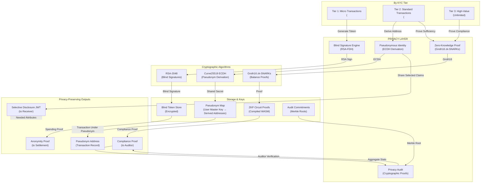

---

## DIAGRAM 7: Layer 5 - Identity Layer (Detailed)

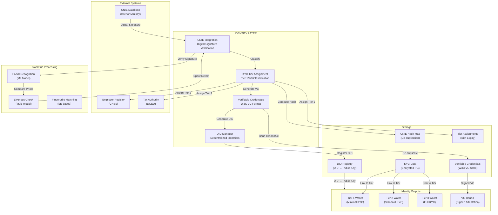

---

## DIAGRAM 8: Layer 6 - Distribution Layer (Detailed)

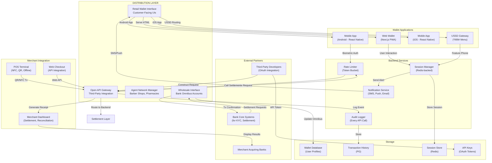

---

## DIAGRAM 9: Layer 7 - Offline Layer (Detailed)

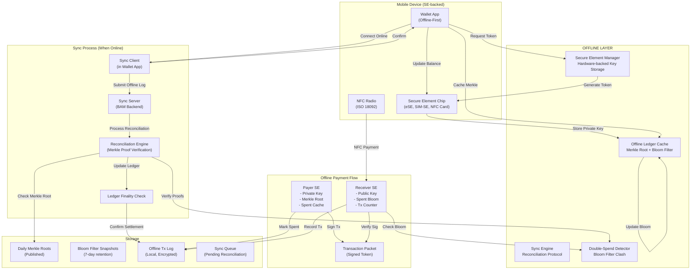

---

## DIAGRAM 10: Layer 8 - Cross-Border Layer (Detailed)

```mermaid
graph TB
    subgraph CROSSBORDER["CROSS-BORDER LAYER"]
        mBRIDGE_CONN["mBridge Connector<br/>Multi-CBDC Settlement"]
        ICEBREAKER_CONN["Icebreaker Connector<br/>Hub-and-Spoke API"]
        FX_ENGINE["FX Conversion Engine<br/>Rate Locking"]
        CAPCTRL_BORDER["Border Capital Controls<br/>Daily/Monthly Limits"]
    end

    subgraph CORRIDORS["Remittance Corridors"]
        EUR_CORRIDOR["EUR-MAD Corridor<br/>(France, Spain, Belgium)"]
        SAR_CORRIDOR["SAR-MAD Corridor<br/>(Gulf Countries)"]
        USD_CORRIDOR["USD-MAD Corridor<br/>(North America)"]
        INTRA_MENA["Intra-MENA Corridor<br/>(Tunisia, Algeria)"]
    end

    subgraph EXTERNAL_CBDCS["External CBDC Systems"]
        ECB_DIGITAL_EUR["ECB Digital Euro<br/>(Eurozone)"]
        PBC_eRMB["PBC e-CNY<br/>(China)"]
        OTHER_CBDCS["Other Central Banks"]
    end

    subgraph FX_MANAGEMENT["FX Management"]
        SPOT_RATE["Spot Rate Feed<br/>(Real-time)"]
        RATE_LOCK["Rate Lock Service<br/>(30-day)"]
        SLIPPAGE_MGMT["Slippage Management<br/>(Limit Orders)"]
        FX_RESERVE["FX Reserve Account<br/>(BAM Treasury)"]
    end

    subgraph CAPITAL_CONTROL["Capital Control Rules"]
        DAILY_LIMITS["Daily Limits per Person<br/>(<EUR 5,000)"]
        MONTHLY_LIMITS["Monthly Limits<br/>(<EUR 50,000)"]
        ANNUAL_LIMITS["Annual Limits<br/>(<EUR 500,000)"]
        COUNTRY_BLOCKS["High-Risk Country Blocks<br/>(Syria, Iran)"]
    end

    subgraph STORAGE["Storage"]
        CROSSBORDER_LOG["Cross-Border Transaction Log<br/>(Audit Trail)"]
        RATE_HISTORY["FX Rate History<br/>(TimeSeries DB)"]
        MONTHLY_COUNTERS["Monthly Counters<br/>(per User)"]
        LOCKED_RATES["Locked Rates<br/>(30-day Contracts)"]
    end

    subgraph EXTERNAL_SYSTEMS["External Systems"]
        SWIFT["SWIFT Network<br/>(Settlement)"]
        UTRF["UTRF<br/>(SAR Reporting)"]
        BIS["BIS Innovation Hub<br/>(mBridge Ops)"]
    end

    EUR_CORRIDOR -->|Sender in France| mBRIDGE_CONN
    EUR_CORRIDOR -->|Recipient in Morocco| mBRIDGE_CONN
    mBRIDGE_CONN -->|Digital EUR → DD| FX_ENGINE
    mBRIDGE_CONN -->|Settlement| ECB_DIGITAL_EUR

    SAR_CORRIDOR -->|Saudi Arabia, UAE| ICEBREAKER_CONN
    ICEBREAKER_CONN -->|Hub-and-Spoke| EXTERNAL_CBDCS

    CAPCTRL_BORDER -->|Check Limit| DAILY_LIMITS
    CAPCTRL_BORDER -->|Check Limit| MONTHLY_LIMITS
    CAPCTRL_BORDER -->|Check Limit| ANNUAL_LIMITS
    CAPCTRL_BORDER -->|Block High-Risk| COUNTRY_BLOCKS

    FX_ENGINE -->|Get Rate| SPOT_RATE
    FX_ENGINE -->|Lock Rate| RATE_LOCK
    RATE_LOCK -->|Store Contract| LOCKED_RATES
    FX_ENGINE -->|Convert Amount| FX_RESERVE

    mBRIDGE_CONN -->|Send Settlement| SWIFT
    mBRIDGE_CONN -->|Report High-Value| UTRF
    mBRIDGE_CONN -->|Coordination| BIS

    CAPCTRL_BORDER -->|Log Tx| CROSSBORDER_LOG
    RATE_LOCK -->|Log Rate| RATE_HISTORY
    CAPCTRL_BORDER -->|Update Counter| MONTHLY_COUNTERS
```

---

## DIAGRAM 11: API Gateway & External Integration

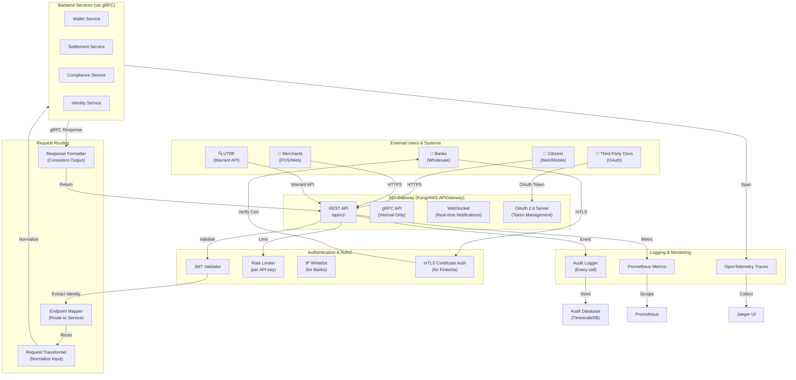

---

## DIAGRAM 12: Message Queue Architecture (Kafka)

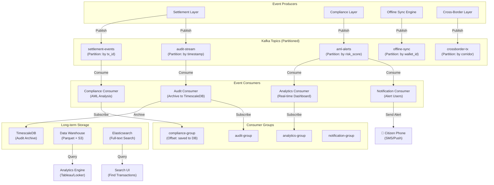

---

## DIAGRAM 13: Database Architecture

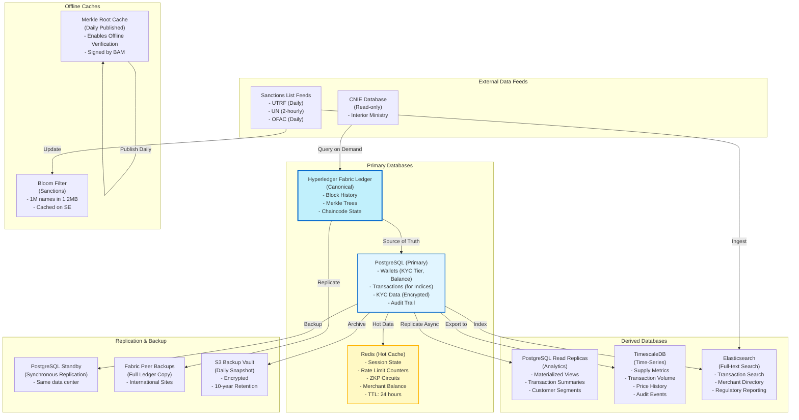

---

## DIAGRAM 14: Data Flow - Complete Transaction Journey

```mermaid
graph LR
    subgraph USER["User/Wallet"]
        USER_WALLET["Wallet App<br/>User Initiates Transfer"]
    end

    subgraph API["API Gateway"]
        API_LAYER["API Gateway<br/>(Validate Request)"]
    end

    subgraph TIER5["Identity Verification"]
        KYC_CHECK["KYC Tier Check<br/>(Layer 5)"]
    end

    subgraph TIER4["Privacy Preparation"]
        PRIVACY_PROOF["Generate Privacy Proof<br/>Blind Sig / ZKP<br/>(Layer 4)"]
    end

    subgraph TIER3["Compliance Screening"]
        COMPLIANCE_SCREEN["Compliance Screening<br/>- Sanctions Check<br/>- AML Behavioral<br/>- Capital Controls<br/>(Layer 3)"]
    end

    subgraph TIER2["Settlement"]
        VALIDATE["Validate Signature<br/>Check Balance<br/>(Layer 2)"]
        CONSENSUS["BFT Consensus<br/>(7-node)"]
        LEDGER_UPDATE["Update Ledger<br/>(Fabric)"]
        FINALITY["Generate Finality Receipt<br/>(Layer 2)"]
    end

    subgraph TIER1["Monetary Update"]
        SUPPLY_UPDATE["Update Supply<br/>Monitoring<br/>(Layer 1)"]
    end

    subgraph STORAGE["Storage"]
        DB_COMMIT["Commit to DB<br/>- Fabric Ledger<br/>- PostgreSQL<br/>- Redis"]
    end

    subgraph QUEUE["Event Stream"]
        EVENT_PUBLISH["Publish to Kafka<br/>- Settlement Event<br/>- Audit Trail"]
    end

    subgraph RESPONSE["Response Path"]
        USER_NOTIFICATION["Notify User<br/>- Finality Receipt<br/>- Transaction Hash<br/>- Confirmation"]
    end

    USER_WALLET -->|POST /transfer| API_LAYER
    API_LAYER -->|JWT Validate| KYC_CHECK
    KYC_CHECK -->|Tier + Limits| PRIVACY_PROOF
    PRIVACY_PROOF -->|Privacy-Wrapped Tx| COMPLIANCE_SCREEN
    COMPLIANCE_SCREEN -->|Allow/Block| VALIDATE
    VALIDATE -->|Valid| CONSENSUS
    CONSENSUS -->|Propose Block| LEDGER_UPDATE
    CONSENSUS -->|Endorse Block| CONSENSUS
    LEDGER_UPDATE -->|Block Committed| FINALITY
    FINALITY -->|Receipt| SUPPLY_UPDATE
    SUPPLY_UPDATE -->|Metrics| DB_COMMIT
    LEDGER_UPDATE -->|Tx Record| DB_COMMIT
    DB_COMMIT -->|Event| EVENT_PUBLISH
    EVENT_PUBLISH -->|Async| QUEUE
    QUEUE -.->|Analytics| ANALYTICS["Analytics<br/>Consumer"]
    FINALITY -->|Receipt Hash| USER_NOTIFICATION
    USER_NOTIFICATION -->|SMS/Push| USER_WALLET

    style USER_WALLET fill:#c8e6c9,stroke:#2e7d32
    style CONSENSUS fill:#bbdefb,stroke:#1565c0,stroke-width:3px
    style LEDGER_UPDATE fill:#e1bee7,stroke:#6a1b9a,stroke-width:2px
    style FINALITY fill:#ffe0b2,stroke:#e65100,stroke-width:2px
```

---

## DIAGRAM 15: Infrastructure Deployment (Kubernetes)

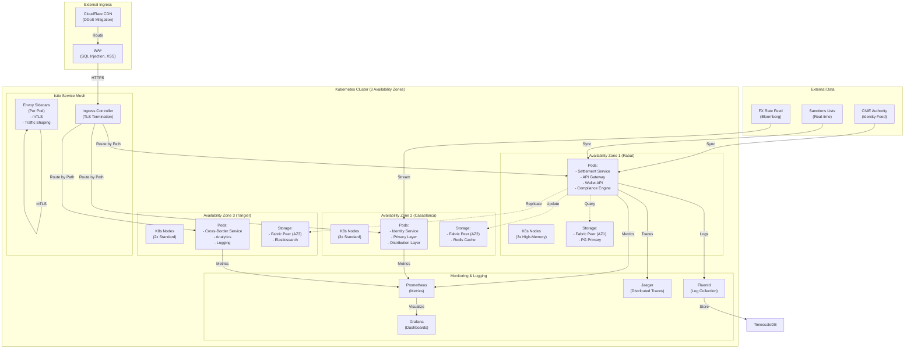

---

## DIAGRAM 16: Security Boundaries & Encryption

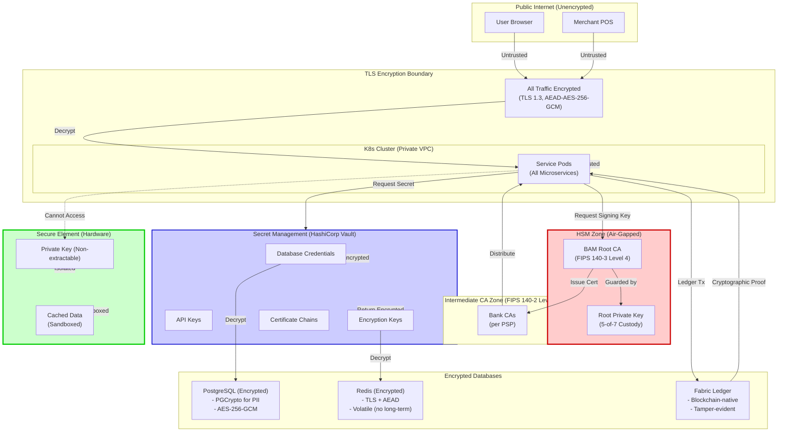

---

## DIAGRAM 17: Transaction Flow - Offline Payment

```mermaid
graph TB
    subgraph OFFLINE_SETUP["Offline Setup (Last Online Sync)"]
        USER_ONLINE["User Online<br/>(at home/cafe)"]
        SYNC_DL["Download:<br/>- Merkle Root<br/>- Spending Limit<br/>- Sanctions List<br/>- Public Certs"]
        SE_CACHE["SE Caches:<br/>- Private Key<br/>- CNIE Pubkey<br/>- Bloom Filter<br/>- Spending Counter"]
    end

    subgraph OFFLINE_PAYMENT["Offline Payment (No Connectivity)"]
        OFFLINE_TX["User Initiates Payment<br/>- Amount: MAD 500<br/>- Recipient: Merchant"]
        CNIE_VERIFY["SE Verifies:<br/>- CNIE is valid<br/>- Not Expired<br/>- Not Revoked"]
        AMOUNT_CHECK["SE Checks:<br/>- Amount <= MAD 500<br/>- Daily Total <= MAD 500<br/>- Offline Days < 72"]
        SIGN_TX["SE Signs Transaction<br/>- Token Hash<br/>- Amount<br/>- Nonce<br/>- Timestamp<br/>- (Ed25519 Signature)"]
        MARK_SPENT["SE Marks Token Spent<br/>(Hardware Enforced)<br/>- Physical Barrier<br/>to Re-spending"]
    end

    subgraph PAYMENT_CHANNEL["NFC Payment Channel"]
        NFC_TX["NFC Broadcast<br/>(ISO 18092)<br/>- Token Hash<br/>- Amount<br/>- Signature<br/>- Nonce"]
    end

    subgraph RECEIVER["Receiver (Merchant)"]
        RECV_VERIFY["Merchant SE Verifies:<br/>- Signature (Ed25519)<br/>- Amount (< limit)<br/>- Nonce (not replayed)"]
        RECV_BLOOM["Merchant SE Checks<br/>Bloom Filter:<br/>- Has this token been spent?<br/>- (Very Low FP Rate)"]
        RECV_ACCEPT["SE Marks Received:<br/>- Token in Received Cache<br/>- Tx in Local Log<br/>- User Gets Receipt<br/>(Can Print QR)"]
    end

    subgraph RECONCILIATION["Later: Online Reconciliation"]
        USER_SYNC["User Comes Online<br/>(next day)"]
        UPLOAD_LOG["Wallet Uploads:<br/>- Offline Tx Log<br/>- Spent Tokens<br/>- Nonces"]
        SERVER_VERIFY["Settlement Server:<br/>- Checks Merkle Proof<br/>- Detects Double-Spend<br/>(if any)"]
        FINALIZE["Settlement Finalizes:<br/>- Ledger Updated<br/>- Balance Confirms<br/>- Tx is Immutable"]
    end

    subgraph DISPUTE_RESOLUTION["Dispute (if Double-Spend)"]
        DOUBLESPEND["Double-Spend Detected:<br/>- Two submissions<br/>of same token"]
        ANALYZE["BAM Analyzes:<br/>- Which submission first?<br/>- Timestamp comparison<br/>- Merkle proof order"]
        WINNER["First Submission Wins<br/>(Based on Merkle<br/>Block Height)"]
        LOSER["Second Tx Rejected:<br/>- Receiver's bank<br/>reverses transfer<br/>- User gets alert"]
    end

    USER_ONLINE -->|Automatic| SYNC_DL
    SYNC_DL -->|Cache Locally| SE_CACHE
    SE_CACHE -->|Ready for Offline| OFFLINE_TX

    OFFLINE_TX -->|SE Check| CNIE_VERIFY
    CNIE_VERIFY -->|All Valid| AMOUNT_CHECK
    AMOUNT_CHECK -->|Within Limit| SIGN_TX
    SIGN_TX -->|Hardware Op| MARK_SPENT
    MARK_SPENT -->|Token Locked| NFC_TX

    NFC_TX -->|ISO 18092| RECV_VERIFY
    RECV_VERIFY -->|Sig OK| RECV_BLOOM
    RECV_BLOOM -->|Not in Bloom| RECV_ACCEPT
    RECV_ACCEPT -->|Local Finality| RECV_ACCEPT

    RECV_ACCEPT -->|Offline Complete| RECONCILIATION
    USER_SYNC -->|Connect| UPLOAD_LOG
    UPLOAD_LOG -->|Cryptographic Proofs| SERVER_VERIFY
    SERVER_VERIFY -->|Merkle Verification| FINALIZE
    FINALIZE -->|T+1 Finality| FINALIZE

    SERVER_VERIFY -->|Clash Detected| DOUBLESPEND
    DOUBLESPEND -->|Investigate| ANALYZE
    ANALYZE -->|Determine Winner| WINNER
    WINNER -->|Reject Loser| LOSER
    LOSER -->|Reverse Transfer| RECV_ACCEPT

    style OFFLINE_SETUP fill:#c8e6c9,stroke:#2e7d32,stroke-width:2px
    style OFFLINE_PAYMENT fill:#fff9c4,stroke:#f57f17,stroke-width:3px
    style PAYMENT_CHANNEL fill:#ffccbc,stroke:#d84315,stroke-width:2px
    style RECONCILIATION fill:#bbdefb,stroke:#1565c0,stroke-width:2px
```

---

## Summary Table: Services, APIs, & Databases

| **Layer** | **Service** | **API Type** | **Database** | **Message Queue** |
|-----------|-----------|-----------|-----------|-----------|
| **1: Monetary** | Issuance Engine | gRPC | Fabric Ledger + PG | Kafka: supply-events |
| **1: Monetary** | Policy Engine | gRPC (Internal) | Git Repo + TimescaleDB | Kafka: policy-updates |
| **2: Settlement** | Transaction Validator | gRPC | Redis (Cache) | Kafka: settlement-events |
| **2: Settlement** | Consensus Engine | N/A (Network) | Fabric Ledger | Kafka: consensus-blocks |
| **2: Settlement** | Ledger Manager | gRPC | Fabric + PG | Kafka: ledger-updates |
| **3: Compliance** | Sanctions Engine | gRPC | Bloom Filter Cache + PG | Kafka: aml-alerts |
| **3: Compliance** | AML Detector | gRPC | ML State + PG | Kafka: aml-escalations |
| **3: Compliance** | SAR Generator | Webhook | SAR Database | Kafka: sar-filed |
| **4: Privacy** | Blind Signature Engine | gRPC | Token Store + Redis | N/A |
| **4: Privacy** | ZKP Engine | gRPC | ZKP Circuits + Redis | N/A |
| **5: Identity** | CNIE Engine | gRPC | CNIE Hash + PG | Kafka: kyc-verifications |
| **5: Identity** | KYC Tier | gRPC | PG (Tier Assignments) | Kafka: tier-changes |
| **6: Distribution** | Retail Wallet API | REST + gRPC | Redis (Sessions) + PG | Kafka: wallet-events |
| **6: Distribution** | Wholesale Interface | ISO 20022 + gRPC | PG (Omnibus) | Kafka: bank-settlements |
| **6: Distribution** | Open API | REST + OAuth | API Keys (Vault) | N/A |
| **7: Offline** | Sync Engine | REST (Upload) + gRPC | Offline Log + PG | Kafka: offline-sync-events |
| **7: Offline** | Double-Spend Detector | gRPC | Bloom Filter + PG | Kafka: doublespend-alerts |
| **8: Cross-Border** | mBridge Connector | mBridge Protocol | PG (Cross-Border Log) | Kafka: crossborder-tx |
| **8: Cross-Border** | Capital Controls | gRPC | PG (Monthly Counters) | Kafka: capctrl-violations |

---

## API Endpoint Examples

### Wallet Service (REST)
```
POST   /api/v1/wallet/create
GET    /api/v1/wallet/{wallet_id}/balance
POST   /api/v1/wallet/{wallet_id}/transfer
GET    /api/v1/wallet/{wallet_id}/history
POST   /api/v1/wallet/{wallet_id}/sync-offline
```

### Settlement Service (gRPC)
```
service Settlement {
  rpc Transfer(TransferRequest) returns (TransferResponse);
  rpc GetBalance(BalanceRequest) returns (BalanceResponse);
  rpc GetFinality(TxHashRequest) returns (FinalityReceipt);
}
```

### Compliance Service (gRPC)
```
service Compliance {
  rpc ScreenTransaction(ScreenRequest) returns (ScreenResponse);
  rpc GenerateSAR(SARRequest) returns (SARResponse);
  rpc CheckSanctions(NameRequest) returns (SanctionsResult);
}
```

### Identity Service (gRPC)
```
service Identity {
  rpc VerifyCNIE(CNIEVerificationRequest) returns (KYCResult);
  rpc IssueDID(DIDRequest) returns (DIDCredential);
  rpc GetVerifiableCredential(CredentialRequest) returns (VC);
}
```

### Cross-Border Service (mBridge Protocol)
```
POST   /mbridge/v1/initiate-transfer
GET    /mbridge/v1/exchange-rate/{corridor}
POST   /mbridge/v1/lock-rate
POST   /icebreaker/v1/query-other-cbdc
```

---

